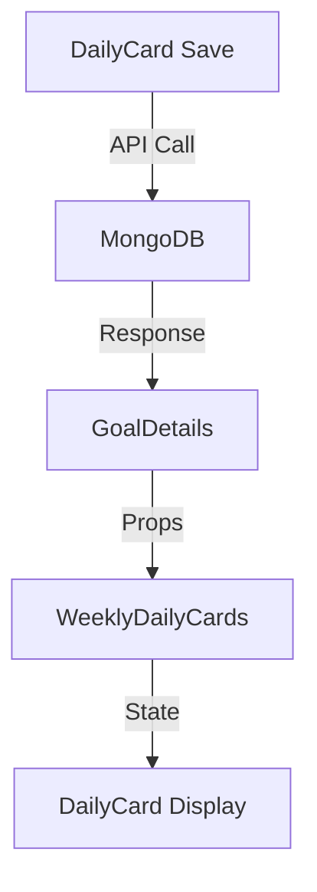

# WeeklyDailyCard Data Update Issue (2025/06/23)

## Related Files
- `/focus-app/client/src/components/GoalDetails/GoalDetails.jsx`
- `/focus-app/client/src/components/GoalDetails/WeeklyDailyCards.jsx`
- `/focus-app/client/src/components/GoalDetails/DailyCard.jsx`
- `/focus-app/client/src/store/mainTaskStore.js`
- `/focus-app/client/src/store/taskRewardStore.js`

## Issue Description
When switching between goals after saving a DailyCard, the updated data was not immediately reflected in the WeeklyDailyCards view. The data was successfully saved to MongoDB but required a page refresh to display.

### Data Flow Analysis


### Problem Identified
The issue was in the goal switching logic in GoalDetails.jsx. The original code had complex logic for local data saving and goal selection, which sometimes prevented immediate data refresh from MongoDB.

### Solution
Simplified the goal switching logic in GoalDetails.jsx to always fetch fresh data from MongoDB:

```javascript
useEffect(() => {
  console.log("goalId in GoalDetails:", goalId);
  if (!goalId) return;

  const refreshGoalData = async () => {
    try {
      const response = await apiService.goals.getById(goalId);
      if (response?.data?.data) {
        setSelectedGoal(response.data.data);
        setDailyCards(response.data.data.dailyCards || []);
      }
    } catch (error) {
      console.error("Error fetching goal data:", error);
    }
  };

  refreshGoalData();
}, [goalId]);
```

### Changes Made
1. Removed complex local data saving logic
2. Simplified goal selection process
3. Added direct MongoDB data fetching
4. Updated both selectedGoal and dailyCards states simultaneously

### Verification Steps
1. Save a new DailyCard record
2. Switch to another goal
3. Switch back to the original goal
4. Verify that all records are displayed correctly without page refresh

### Impact
- Improved data consistency
- Eliminated the need for manual page refresh
- Maintained existing timezone handling
- No changes to other components required

## Future Considerations
1. Consider implementing optimistic updates
2. Add loading states during data fetching
3. Implement error recovery mechanisms
4. Consider caching strategies for frequently accessed data 