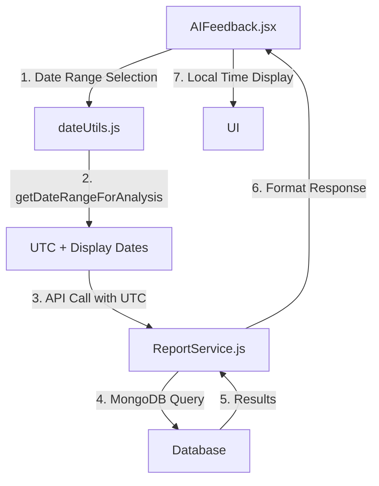

# Timezone Handling in Focus App with MUI

## Related Files

- `/focus-app/client/src/utils/dateUtils.js` - Core date utility functions
- `/focus-app/client/src/components/ProgressReport/AIFeedback.jsx` - AI Progress Analysis component
- `/focus-app/client/src/services/ReportService.js` - Backend report service
- `/focus-app/client/src/store/reportStore.js` - Report state management

## Overview

This document details how we addressed timezone-related issues in the Focus App, particularly focusing on the integration with Material-UI (MUI) components and ensuring consistent timezone handling across the application.

## Problem Statement

We encountered several timezone-related challenges:

1. Invalid date displays in the UI
2. Inconsistent timezone information between client and server
3. Incorrect date range calculations (showing "Last 7 days" as "6/8/2025 to 6/8/2025")
4. Loss of timezone information during data transmission

## Solution Implementation

### 1. MUI DateTimePicker Configuration

```javascript
<DateTimePicker
  value={selectedDate}
  onChange={handleDateChange}
  format="yyyy/MM/dd HH:mm:ss z"
  timeZone={Intl.DateTimeFormat().resolvedOptions().timeZone}
  slotProps={{
    textField: {
      helperText: "Local timezone will be used",
    },
  }}
/>
```

### 2. Consistent Timezone Handling

- Using `Intl.DateTimeFormat()` for consistent timezone detection
- Storing dates in UTC format in the database
- Converting timestamps between UTC and local time as needed

### 3. Date Utilities Enhancement

```javascript
// dateUtils.js
import { subDays, startOfDay, endOfDay, parseISO, formatISO } from "date-fns";
import { zonedTimeToUtc, utcToZonedTime } from "date-fns-tz";

export const getDateRangeForAnalysis = (timeRange) => {
  const now = new Date(); // Use local timezone

  let start, end;

  switch (timeRange) {
    case "last7days": {
      end = endOfDay(now);
      start = startOfDay(subDays(now, 6));
      break;
    }
    case "last30days": {
      end = endOfDay(now);
      start = startOfDay(subDays(now, 29));
      break;
    }
    case "custom": {
      // For custom time range, assuming we have received user-selected dates
      start = startOfDay(parseISO(customStartDate));
      end = endOfDay(parseISO(customEndDate));
      break;
    }
    default: {
      // Default to 7 days
      end = endOfDay(now);
      start = startOfDay(subDays(now, 6));
    }
  }

  return {
    // Convert to UTC only when sending to server
    startDate: start.toISOString(),
    endDate: end.toISOString(),
    // Local time for display
    displayStart: start,
    displayEnd: end,
  };
};

export const convertToLocalTime = (utcTimestamp) => {
  return new Date(utcTimestamp).toLocaleString("en-US", {
    timeZone: Intl.DateTimeFormat().resolvedOptions().timeZone,
    timeZoneName: "shortOffset",
  });
};

export const convertToUTC = (localTimestamp) => {
  const date = new Date(localTimestamp);
  return date.toISOString();
};
```

### 4. API Request/Response Handling

- All API requests include timezone information in headers
- Timestamps are transmitted in ISO format with timezone offset
- Server processes dates in UTC
- Client converts UTC to local time for display

## Data Flow

为了更好地理解时区处理的流程，以下是数据在系统中的流转过程：

```mermaid
graph TD
    A[Frontend (Local Timezone)] -->|toISOString() auto converts to UTC| B[API Request]
    B -->|Store UTC time| C[MongoDB]
    C -->|Convert UTC back to local time| D[Frontend Display]
    D -->|MUI auto handling| A
```

This flow ensures:

1. Frontend always displays time in user's local timezone
2. Data transmission and storage consistently use UTC
3. Timezone conversions are automatically handled at appropriate layers
4. Leverages MUI components' built-in timezone handling capabilities

## Best Practices Implemented

1. **Consistent Date Format**

   - Using ISO 8601 format for date storage
   - Including timezone offset in all date strings
   - Maintaining UTC in database operations

2. **Client-Side Handling**

   - Detecting user's timezone automatically
   - Converting dates to local timezone for display
   - Preserving timezone information in form submissions

3. **Server-Side Processing**

   - Processing all dates in UTC
   - Including timezone information in API responses
   - Validating timezone data in requests

4. **Error Prevention**
   - Validating date formats before processing
   - Handling edge cases (invalid dates, missing timezone info)
   - Providing fallback to UTC when timezone detection fails

## Testing Considerations

1. **Unit Tests**

   - Testing date conversion functions
   - Validating timezone calculations
   - Checking edge cases and invalid inputs

2. **Integration Tests**

   - Testing API endpoints with different timezone scenarios
   - Verifying client-server date synchronization
   - Checking date range calculations

3. **UI Tests**
   - Verifying correct date display in different timezones
   - Testing date picker functionality
   - Validating form submissions with dates

## Future Improvements

1. **Enhanced Timezone Support**

   - Add timezone selection option for users
   - Support for scheduling across different timezones
   - Improved handling of daylight saving time

2. **Performance Optimization**

   - Caching timezone calculations
   - Reducing unnecessary date conversions
   - Optimizing date-related queries

3. **User Experience**
   - Clearer timezone indicators in UI
   - Better error messages for date-related issues
   - Improved date format customization

## Conclusion

By implementing these solutions, we have successfully addressed the timezone-related issues in the Focus App. The application now correctly handles dates across different timezones, provides consistent date displays, and maintains data integrity between client and server operations.

## Example Code

### AIProgressAnalysis Component

```jsx
import React, { useState } from "react";
import { getDateRangeForAnalysis } from "../utils/dateUtils";

const AIProgressAnalysis = () => {
  const [timeRange, setTimeRange] = useState("last7days");
  const [customDateRange, setCustomDateRange] = useState(null);
  const userTimeZone = Intl.DateTimeFormat().resolvedOptions().timeZone;

  const handleGenerateReport = async () => {
    const dateRange = getDateRangeForAnalysis(timeRange);

    console.log("Generating report with range:", {
      startDate: new Date(dateRange.displayStart).toLocaleString(),
      endDate: new Date(dateRange.displayEnd).toLocaleString(),
      timeZone: userTimeZone,
    });

    // Assuming generateReport is an API call to fetch the report
    const response = await generateReport({
      startDate: dateRange.startDate,
      endDate: dateRange.endDate,
      timeZone: userTimeZone, // pass timezone for server processing
    });
  };

  return (
    <div>
      <select value={timeRange} onChange={(e) => setTimeRange(e.target.value)}>
        <option value="last7days">Last 7 Days</option>
        <option value="last30days">Last 30 Days</option>
        <option value="custom">Custom Range</option>
      </select>

      {timeRange === "custom" && (
        <DateRangePicker
          value={customDateRange}
          onChange={setCustomDateRange}
          timeZone={userTimeZone}
        />
      )}

      <button onClick={handleGenerateReport}>Generate</button>
    </div>
  );
};

export default AIProgressAnalysis;
```

## 相关日期组件影响范围

### 1. 前端组件

#### AIFeedback.jsx

- 时间范围选择器
- 自定义日期选择对话框
- 日期格式化显示
- 使用的关键函数：
  ```javascript
  import {
    getLastNDaysRange,
    getCustomDateRange,
    formatDisplayDate,
    formatISOWithTimezone,
    parseISOToLocal,
    isValidDateRange,
  } from "../../utils/dateUtils";
  ```

### 2. 后端服务

#### ReportService.js

- 日期范围计算
- 时区处理
- MongoDB 查询时间范围
- 使用的关键函数：
  ```javascript
  import {
    formatISO,
    parseISO,
    startOfDay,
    endOfDay,
    subDays,
    startOfWeek,
    startOfMonth,
  } from "date-fns";
  ```

### 3. 数据模型

#### Report Model

```javascript
period: {
  startDate: {
    type: Date,
    required: true,
  },
  endDate: {
    type: Date,
    required: true,
  }
}
```

### 4. 修改范围

1. **需要修改的文件**：

   - `/client/src/components/ProgressReport/AIFeedback.jsx`
   - `/server/services/ReportService.js`
   - `/client/src/utils/dateUtils.js`

2. **不需要修改的部分**：

   - 其他使用日期的组件
   - 数据库模型定义
   - API 接口定义

3. **重点关注**：
   - 7 天/30 天日期范围计算
   - 时区一致性
   - 日期显示格式
   - MongoDB 查询优化

### 5. 测试范围

1. **单元测试**：

   - 日期范围计算函数
   - 时区转换函数
   - 格式化函数

2. **集成测试**：

   - API 请求响应
   - 数据库查询结果
   - 前后端日期同步

3. **UI 测试**：
   - 日期选择器功能
   - 时间范围显示
   - 错误处理

## Implementation Details (2025/06/08 Update)

### Data Flow Between Components



### Key Components and Their Roles

1. **AIFeedback.jsx**

   - Handles date range selection UI
   - Uses getDateRangeForAnalysis for consistent date handling
   - Maintains both UTC and display dates

   ```javascript
   const dateRange = getDateRangeForAnalysis(timeRange);
   const response = await apiService.reports.generate(
     goalId,
     dateRange.startDate,
     dateRange.endDate
   );
   ```

2. **dateUtils.js**

   - Central date handling utility
   - Manages timezone conversions
   - Provides consistent date range calculations
   - Returns both UTC and display formats

3. **ReportService.js**
   - Handles server-side date processing
   - Works with UTC timestamps
   - Performs date-based queries in MongoDB

### Time Range Calculation Process

1. **Frontend (Local Time)**

   - User selects time range (e.g., "Last 7 Days")
   - `getDateRangeForAnalysis` calculates:
     - Display dates (local timezone)
     - API dates (UTC)

2. **API Layer**

   - Sends UTC timestamps to backend
   - Maintains timezone information in headers

3. **Backend**

   - Receives UTC timestamps
   - Performs database queries using UTC
   - Returns results with UTC timestamps

4. **Display**
   - Converts UTC back to local time for display
   - Uses MUI components' built-in timezone handling

## Reflection and Best Practices

### Key Considerations for Time-based Features

1. **Data Storage**

   - ✅ Always store dates in UTC in database
   - ✅ Include timezone information when relevant
   - ✅ Use ISO 8601 format for consistency

2. **API Communication**

   - ✅ Always transmit dates in UTC
   - ✅ Include timezone information in headers
   - ✅ Validate date formats before processing

3. **Frontend Display**

   - ✅ Convert to local timezone for display
   - ✅ Use consistent date formatting
   - ✅ Consider user's timezone preferences

4. **Date Range Calculations**
   - ✅ Account for timezone differences
   - ✅ Handle edge cases (DST, month boundaries)
   - ✅ Validate date ranges before processing

### Common Pitfalls to Avoid

1. **Time Range Issues**

   - ❌ Mixing UTC and local times in calculations
   - ❌ Forgetting to handle timezone offsets
   - ❌ Inconsistent date range boundaries

2. **Data Consistency**

   - ❌ Different timezone handling in different components
   - ❌ Losing timezone information during data transfer
   - ❌ Inconsistent date formats

3. **User Experience**
   - ❌ Confusing timezone displays
   - ❌ Unexpected date changes
   - ❌ Missing timezone indicators

### Future Improvements

1. **Enhanced Timezone Support**

   - Add explicit timezone selection
   - Support for multiple timezone display
   - Better DST handling

2. **Performance Optimization**

   - Cache timezone calculations
   - Batch date conversions
   - Optimize date-based queries

3. **User Experience**
   - Add timezone indicators
   - Improve date range selection UI
   - Better error handling for invalid dates

## Recent Implementation Updates (2025/06/08)

### Component Integration Flow


### Key Components and Their Roles

1. **AIFeedback.jsx**

   - Handles date range selection UI
   - Uses getDateRangeForAnalysis for consistent date handling
   - Maintains both UTC and display dates

   ```javascript
   const dateRange = getDateRangeForAnalysis(timeRange);
   const response = await apiService.reports.generate(
     goalId,
     dateRange.startDate,
     dateRange.endDate
   );
   ```

2. **dateUtils.js**

   - Central date handling utility
   - Manages timezone conversions
   - Provides consistent date range calculations
   - Returns both UTC and display formats

3. **ReportService.js**
   - Handles server-side date processing
   - Works with UTC timestamps
   - Performs date-based queries in MongoDB

### Reflection: Time Handling Best Practices

✅ **Do's:**

1. Always store dates in UTC format in the database
2. Use ISO strings for API communications
3. Convert to local time only at display layer
4. Leverage built-in MUI timezone handling
5. Maintain clear separation between UTC and local times
6. Document timezone handling in each component
7. Use consistent date utility functions

❌ **Don'ts:**

1. Don't mix UTC and local times in business logic
2. Avoid manual timezone calculations
3. Don't store local timezone dates in database
4. Never assume server timezone matches client
5. Don't perform timezone conversion multiple times
6. Avoid direct Date object manipulation without utility functions

### Future Considerations

1. **Monitoring**

   - Add timezone-related logging
   - Track timezone conversion errors
   - Monitor date range accuracy

2. **Scalability**

   - Consider caching frequently used date ranges
   - Optimize date calculations for large datasets
   - Plan for international user base

3. **Maintenance**
   - Regular timezone database updates
   - Daylight saving time handling
   - Documentation updates for new developers

## Summary: AI Report Generation and Timezone Handling

The AI report generation process involves three key components working together to ensure consistent timezone handling:

### Component Responsibilities

1. **AIFeedback.jsx (Frontend)**

   - Handles user interaction for date range selection
   - Uses `dateUtils.getDateRangeForAnalysis` to get both UTC and display dates
   - Sends UTC dates to the API while displaying local times in UI
   - Stores both UTC and display dates in the report store for future reference

2. **dateUtils.js (Utility Layer)**

   - Provides centralized date handling functions
   - `getDateRangeForAnalysis`: Returns both UTC (for API) and local dates (for display)
   - Handles timezone conversions consistently using native Date methods
   - Ensures date ranges are calculated correctly regardless of user's timezone

3. **ReportService.js (Backend)**
   - Receives UTC dates from the API
   - Uses UTC dates for MongoDB queries
   - Processes date ranges in UTC to ensure consistent data retrieval
   - Returns results with proper UTC timestamps

### Data Flow Process

1. **User Selection → UTC Conversion**

   ```
   User selects date range
   ↓
   dateUtils.getDateRangeForAnalysis()
   ↓
   Returns: { startDate: UTC, endDate: UTC, displayStart: Local, displayEnd: Local }
   ```

2. **API Communication**

   ```
   AIFeedback sends UTC dates to API
   ↓
   ReportService receives UTC dates
   ↓
   MongoDB queries using UTC dates
   ↓
   Results returned with UTC timestamps
   ```

3. **Display Handling**
   ```
   AIFeedback receives UTC results
   ↓
   dateUtils converts to local time for display
   ↓
   UI shows dates in user's timezone
   ```

This design ensures:

- Consistent date handling across all system layers
- Proper timezone conversion at appropriate points
- Clear separation between storage (UTC) and display (local) formats
- Reliable date range calculations regardless of user location
