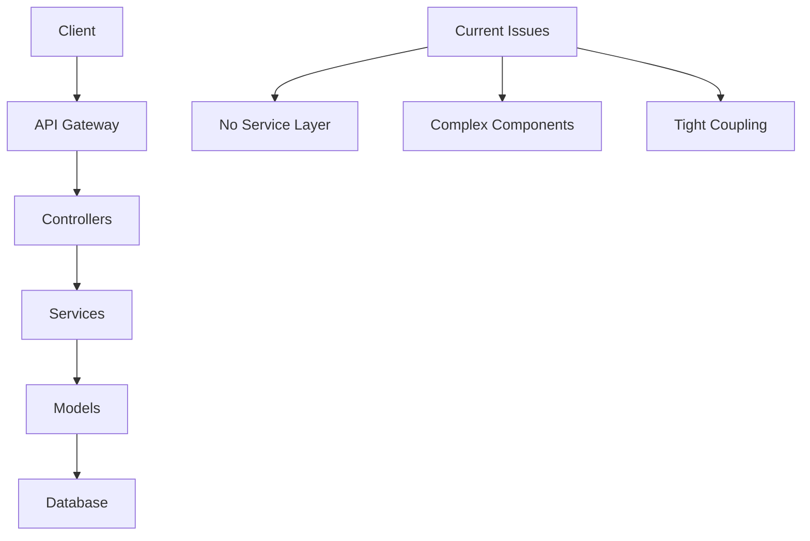

# Reflection: How to Write Clean Code If We Redo the Project

## Related Files (相关文件清单)
- `focus-app/docs/plan-20250706-refactor.md` - Main refactoring plan
- `focus-app/server/controllers/goalsController.js` - Example of complex controller
- `focus-app/client/src/components/GoalDetails/GoalDetails.jsx` - Example of complex component
- `focus-app/client/src/components/WeeklyMemo.jsx` - Example of complex component
- `focus-app/server/models/Goal.js` - Example of complex data model

---

# ENGLISH SECTION

## Executive Summary

This document reflects on the FocusAppAI project's current state and provides actionable insights for writing cleaner, more maintainable code. Based on our refactoring analysis, we've identified key areas for improvement and established best practices for future development.

## Project Presentation Best Practices

### 1. How to Present Your Project for Refactoring

#### A. Create a Project Overview Document
```markdown
# Project Overview Template

## Architecture Summary
- **Frontend**: React + Zustand + MUI
- **Backend**: Node.js + Express + MongoDB
- **Key Features**: Goal tracking, AI analysis, Progress reporting

## Current Pain Points
1. Component complexity (800+ lines)
2. Missing service layer
3. Complex data models
4. State management issues

## Metrics
- Total Lines of Code: ~50,000
- Average Component Size: 400 lines
- Test Coverage: 45%
- Performance Issues: 3-second load time
```

#### B. Provide Code Complexity Analysis
```javascript
// Example: Complexity Analysis
const complexityMetrics = {
  components: {
    'GoalDetails.jsx': { lines: 836, complexity: 'HIGH', responsibilities: 8 },
    'WeeklyMemo.jsx': { lines: 977, complexity: 'CRITICAL', responsibilities: 12 }
  },
  controllers: {
    'goalsController.js': { lines: 734, complexity: 'HIGH', endpoints: 15 }
  },
  models: {
    'Goal.js': { lines: 181, complexity: 'MEDIUM', nested_levels: 4 }
  }
};
```

#### C. Create Visual Architecture Diagrams


### 2. Essential Documentation for Refactoring

#### A. Component Dependency Map
```javascript
// Example: Component Dependencies
const componentDependencies = {
  'GoalDetails': [
    'DailyTasks',
    'WeeklyDailyCards', 
    'GoalDeclaration',
    'DailyCardRecord',
    'GoalStore',
    'ProgressStore'
  ],
  'WeeklyMemo': [
    'AIFeedback',
    'ReportService',
    'DateUtils',
    'UserStore'
  ]
};
```

#### B. API Endpoint Documentation
```javascript
// Example: API Complexity Analysis
const apiComplexity = {
  '/api/goals': {
    methods: ['GET', 'POST', 'PUT', 'DELETE'],
    complexity: 'HIGH',
    businessLogic: 'Mixed with HTTP handling',
    issues: ['No validation layer', 'Direct DB access']
  },
  '/api/reports': {
    methods: ['POST', 'GET'],
    complexity: 'CRITICAL',
    businessLogic: 'AI integration + RAG',
    issues: ['Timeout handling', 'Error propagation']
  }
};
```

## Collaboration Improvement Strategies

### 1. Enhanced Communication Protocol

#### A. Pre-Development Checklist
```markdown
## Before Starting Any Task

### Requirements Clarification
- [ ] Understand the exact scope
- [ ] Identify all affected files
- [ ] Confirm styling constraints
- [ ] Verify backward compatibility needs

### Technical Assessment
- [ ] Review existing code structure
- [ ] Identify potential conflicts
- [ ] Plan testing approach
- [ ] Consider performance impact

### Communication Protocol
- [ ] Ask specific questions about unclear requirements
- [ ] Provide detailed implementation plan
- [ ] Request explicit authorization before coding
- [ ] Document all assumptions
```

#### B. Improved Issue Reporting Format
```markdown
## Issue Report Template

### Problem Description
- **Component**: GoalDetails.jsx
- **Issue Type**: CSS Layout Break
- **Severity**: High
- **Browser**: Chrome 91+

### Steps to Reproduce
1. Navigate to goal details page
2. Resize window to mobile view
3. Observe layout overflow

### Expected vs Actual Behavior
- **Expected**: Responsive layout
- **Actual**: Horizontal scroll appears

### Proposed Solution
- Use CSS Grid instead of Flexbox
- Add responsive breakpoints
- Test across devices

### Files to Modify
- `GoalDetails.module.css` (lines 45-67)
- `GoalDetails.jsx` (className updates)
```

### 2. Specific Lessons Learned

#### A. CSS and Styling Issues

**Problem**: Frequent CSS conflicts and layout breaks
```css
/* Bad Practice - What We Did */
.goal-details {
  position: absolute;
  width: 100%;
  height: calc(100vh - 64px);
  overflow-y: auto;
}

/* Good Practice - What We Should Do */
.goal-details {
  display: grid;
  grid-template-rows: auto 1fr;
  min-height: 0;
  container-type: inline-size;
}

@container (max-width: 768px) {
  .goal-details {
    grid-template-rows: auto auto 1fr;
  }
}
```

**Solution Strategy**:
1. **Use CSS Custom Properties for Consistency**
```css
:root {
  --header-height: 64px;
  --sidebar-width: 280px;
  --content-padding: 16px;
  --border-radius: 8px;
}
```

2. **Implement Design System Approach**
```javascript
// theme/spacing.js
export const spacing = {
  xs: '4px',
  sm: '8px',
  md: '16px',
  lg: '24px',
  xl: '32px'
};

// theme/breakpoints.js
export const breakpoints = {
  mobile: '320px',
  tablet: '768px',
  desktop: '1024px',
  wide: '1440px'
};
```

#### B. Time and Calendar Handling Issues

**Problem**: Timezone inconsistencies and date formatting errors
```javascript
// Bad Practice - What We Did
const formatDate = (date) => {
  return new Date(date).toLocaleDateString();
};

// Issues:
// 1. No timezone handling
// 2. Browser-dependent formatting
// 3. No error handling
```

**Solution Strategy**:
```javascript
// Good Practice - What We Should Do
import { format, parseISO, isValid } from 'date-fns';
import { zonedTimeToUtc, utcToZonedTime } from 'date-fns-tz';

export class DateUtils {
  static formatDate(date, userTimezone = 'UTC', formatString = 'yyyy-MM-dd') {
    try {
      if (!date) return '';
      
      const parsedDate = typeof date === 'string' ? parseISO(date) : date;
      if (!isValid(parsedDate)) return '';
      
      const zonedDate = utcToZonedTime(parsedDate, userTimezone);
      return format(zonedDate, formatString);
    } catch (error) {
      console.error('Date formatting error:', error);
      return '';
    }
  }
  
  static createUTCDate(localDate, userTimezone) {
    try {
      return zonedTimeToUtc(localDate, userTimezone);
    } catch (error) {
      console.error('UTC conversion error:', error);
      return new Date();
    }
  }
  
  static getWeekBoundaries(date, userTimezone) {
    // Implementation for consistent week calculations
    const startOfWeek = startOfWeek(date, { weekStartsOn: 1 }); // Monday
    const endOfWeek = endOfWeek(date, { weekStartsOn: 1 });
    
    return {
      start: this.createUTCDate(startOfWeek, userTimezone),
      end: this.createUTCDate(endOfWeek, userTimezone)
    };
  }
}
```

## Clean Code Principles for Refactoring

### 1. Single Responsibility Principle (SRP)

#### Before (Problematic)
```javascript
// GoalDetails.jsx - 836 lines, multiple responsibilities
const GoalDetails = () => {
  // State management (50+ lines)
  const [selectedGoal, setSelectedGoal] = useState(null);
  const [deleteDialogOpen, setDeleteDialogOpen] = useState(false);
  const [dailyCards, setDailyCards] = useState([]);
  // ... 20+ more state variables
  
  // API calls (100+ lines)
  const fetchGoalData = async () => { /* ... */ };
  const updateGoalProgress = async () => { /* ... */ };
  const deleteGoal = async () => { /* ... */ };
  // ... 10+ more API functions
  
  // UI event handlers (150+ lines)
  const handleTabChange = () => { /* ... */ };
  const handleDeleteConfirm = () => { /* ... */ };
  const handleProgressUpdate = () => { /* ... */ };
  // ... 15+ more handlers
  
  // Render logic (500+ lines)
  return (
    <div>
      {/* Massive JSX structure */}
    </div>
  );
};
```

#### After (Clean)
```javascript
// GoalDetailsContainer.jsx - 120 lines, single responsibility
const GoalDetailsContainer = () => {
  const { goalId } = useParams();
  const { goal, loading, error } = useGoal(goalId);
  
  if (loading) return <LoadingSpinner />;
  if (error) return <ErrorMessage error={error} />;
  if (!goal) return <NotFoundMessage />;
  
  return <GoalDetailsView goal={goal} />;
};

// GoalDetailsView.jsx - 80 lines, presentation only
const GoalDetailsView = ({ goal }) => {
  const [activeTab, setActiveTab] = useState('overview');
  
  return (
    <div className="goal-details">
      <GoalHeader goal={goal} />
      <GoalTabs activeTab={activeTab} onTabChange={setActiveTab} />
      <GoalContent goal={goal} activeTab={activeTab} />
    </div>
  );
};

// useGoal.js - 60 lines, data management only
export const useGoal = (goalId) => {
  const [goal, setGoal] = useState(null);
  const [loading, setLoading] = useState(true);
  const [error, setError] = useState(null);
  
  useEffect(() => {
    loadGoal(goalId);
  }, [goalId]);
  
  const loadGoal = async (id) => {
    try {
      setLoading(true);
      const response = await GoalService.getById(id);
      setGoal(response.data);
    } catch (err) {
      setError(err);
    } finally {
      setLoading(false);
    }
  };
  
  return { goal, loading, error, refetch: () => loadGoal(goalId) };
};
```

### 2. Dependency Inversion Principle

#### Before (Tight Coupling)
```javascript
// goalsController.js - Direct database access
export const createGoal = async (req, res) => {
  try {
    // Validation mixed with business logic
    if (!req.body.title) {
      return res.status(400).json({ error: 'Title required' });
    }
    
    // Direct MongoDB operations
    const goal = new Goal({
      userId: req.user.id,
      title: req.body.title,
      description: req.body.description,
      createdAt: new Date()
    });
    
    await goal.save();
    
    // Response handling mixed with business logic
    res.status(201).json({
      success: true,
      data: goal
    });
  } catch (error) {
    res.status(500).json({ error: error.message });
  }
};
```

#### After (Dependency Injection)
```javascript
// GoalController.js - Clean separation
export class GoalController {
  constructor(goalService, validator, responseHandler) {
    this.goalService = goalService;
    this.validator = validator;
    this.responseHandler = responseHandler;
  }
  
  async createGoal(req, res) {
    try {
      const validatedData = await this.validator.validateGoalData(req.body);
      const goal = await this.goalService.createGoal(validatedData, req.user.id);
      this.responseHandler.success(res, goal, 'Goal created successfully');
    } catch (error) {
      this.responseHandler.error(res, error);
    }
  }
}

// GoalService.js - Business logic only
export class GoalService {
  constructor(goalRepository, eventEmitter) {
    this.goalRepository = goalRepository;
    this.eventEmitter = eventEmitter;
  }
  
  async createGoal(goalData, userId) {
    const goal = await this.goalRepository.create({
      ...goalData,
      userId,
      status: 'active',
      createdAt: new Date()
    });
    
    this.eventEmitter.emit('goal.created', goal);
    return goal;
  }
}

// GoalRepository.js - Data access only
export class GoalRepository {
  constructor(model) {
    this.model = model;
  }
  
  async create(data) {
    return await this.model.create(data);
  }
  
  async findById(id) {
    return await this.model.findById(id);
  }
  
  async findByUserId(userId) {
    return await this.model.find({ userId });
  }
}
```

### 3. Error Handling Strategy

#### Before (Inconsistent)
```javascript
// Multiple different error handling patterns
const fetchGoals = async () => {
  try {
    const response = await api.get('/goals');
    setGoals(response.data);
  } catch (error) {
    console.error(error);
    alert('Failed to load goals');
  }
};

const updateGoal = async (id, data) => {
  const response = await api.put(`/goals/${id}`, data);
  if (!response.ok) {
    throw new Error('Update failed');
  }
  return response.data;
};
```

#### After (Consistent)
```javascript
// Centralized error handling
export class ApiError extends Error {
  constructor(message, statusCode, code) {
    super(message);
    this.statusCode = statusCode;
    this.code = code;
  }
}

export class ErrorHandler {
  static handle(error, context = '') {
    const errorInfo = {
      message: error.message,
      statusCode: error.statusCode || 500,
      code: error.code || 'UNKNOWN_ERROR',
      context,
      timestamp: new Date().toISOString()
    };
    
    // Log error
    console.error('Error:', errorInfo);
    
    // Report to monitoring service
    if (process.env.NODE_ENV === 'production') {
      this.reportError(errorInfo);
    }
    
    return errorInfo;
  }
  
  static reportError(errorInfo) {
    // Send to monitoring service
  }
}

// Usage in components
const useGoalOperations = () => {
  const [error, setError] = useState(null);
  
  const handleError = (error, operation) => {
    const errorInfo = ErrorHandler.handle(error, `Goal ${operation}`);
    setError(errorInfo);
    
    // Show user-friendly message
    toast.error(this.getUserFriendlyMessage(errorInfo));
  };
  
  const getUserFriendlyMessage = (errorInfo) => {
    switch (errorInfo.code) {
      case 'NETWORK_ERROR':
        return 'Please check your internet connection';
      case 'VALIDATION_ERROR':
        return 'Please check your input and try again';
      case 'UNAUTHORIZED':
        return 'Please log in again';
      default:
        return 'Something went wrong. Please try again later';
    }
  };
  
  return { error, handleError };
};
```

## Testing Strategy for Clean Code

### 1. Unit Testing Structure
```javascript
// GoalService.test.js
describe('GoalService', () => {
  let goalService;
  let mockRepository;
  let mockEventEmitter;
  
  beforeEach(() => {
    mockRepository = {
      create: jest.fn(),
      findById: jest.fn(),
      findByUserId: jest.fn()
    };
    mockEventEmitter = {
      emit: jest.fn()
    };
    goalService = new GoalService(mockRepository, mockEventEmitter);
  });
  
  describe('createGoal', () => {
    it('should create goal with correct data', async () => {
      const goalData = { title: 'Test Goal', description: 'Test Description' };
      const userId = 'user123';
      const expectedGoal = { id: 'goal123', ...goalData, userId };
      
      mockRepository.create.mockResolvedValue(expectedGoal);
      
      const result = await goalService.createGoal(goalData, userId);
      
      expect(mockRepository.create).toHaveBeenCalledWith({
        ...goalData,
        userId,
        status: 'active',
        createdAt: expect.any(Date)
      });
      expect(mockEventEmitter.emit).toHaveBeenCalledWith('goal.created', expectedGoal);
      expect(result).toEqual(expectedGoal);
    });
  });
});
```

### 2. Integration Testing
```javascript
// GoalController.integration.test.js
describe('Goal API Integration', () => {
  let app;
  let testUser;
  
  beforeEach(async () => {
    app = await createTestApp();
    testUser = await createTestUser();
  });
  
  afterEach(async () => {
    await cleanupTestData();
  });
  
  describe('POST /api/goals', () => {
    it('should create goal successfully', async () => {
      const goalData = {
        title: 'Test Goal',
        description: 'Test Description',
        priority: 'High'
      };
      
      const response = await request(app)
        .post('/api/goals')
        .set('Authorization', `Bearer ${testUser.token}`)
        .send(goalData)
        .expect(201);
      
      expect(response.body.success).toBe(true);
      expect(response.body.data.title).toBe(goalData.title);
      expect(response.body.data.userId).toBe(testUser.id);
    });
  });
});
```

## Performance Optimization Guidelines

### 1. Component Optimization
```javascript
// Before - Unnecessary re-renders
const GoalList = ({ goals, onGoalUpdate }) => {
  return (
    <div>
      {goals.map(goal => (
        <GoalCard
          key={goal.id}
          goal={goal}
          onUpdate={onGoalUpdate}
          formatDate={(date) => new Date(date).toLocaleDateString()}
        />
      ))}
    </div>
  );
};

// After - Optimized with memoization
const GoalList = React.memo(({ goals, onGoalUpdate }) => {
  const formatDate = useCallback((date) => {
    return new Date(date).toLocaleDateString();
  }, []);
  
  return (
    <div>
      {goals.map(goal => (
        <GoalCard
          key={goal.id}
          goal={goal}
          onUpdate={onGoalUpdate}
          formatDate={formatDate}
        />
      ))}
    </div>
  );
});

const GoalCard = React.memo(({ goal, onUpdate, formatDate }) => {
  const handleUpdate = useCallback((updates) => {
    onUpdate(goal.id, updates);
  }, [goal.id, onUpdate]);
  
  return (
    <div className="goal-card">
      <h3>{goal.title}</h3>
      <p>{formatDate(goal.createdAt)}</p>
      <button onClick={() => handleUpdate({ status: 'completed' })}>
        Complete
      </button>
    </div>
  );
});
```

### 2. State Management Optimization
```javascript
// Before - Inefficient state updates
const useGoalStore = create((set, get) => ({
  goals: [],
  updateGoal: (goalId, updates) => {
    set(state => ({
      goals: state.goals.map(goal => 
        goal.id === goalId ? { ...goal, ...updates } : goal
      )
    }));
  }
}));

// After - Optimized with immer
const useGoalStore = create(
  immer((set, get) => ({
    goals: [],
    updateGoal: (goalId, updates) => {
      set(state => {
        const goal = state.goals.find(g => g.id === goalId);
        if (goal) {
          Object.assign(goal, updates);
        }
      });
    }
  }))
);
```

## Deployment and DevOps Best Practices

### 1. Environment Configuration
```javascript
// config/environment.js
export const config = {
  development: {
    apiUrl: 'http://localhost:5000',
    mongoUrl: process.env.MONGODB_URI_DEV,
    logLevel: 'debug'
  },
  production: {
    apiUrl: process.env.API_URL,
    mongoUrl: process.env.MONGODB_URI,
    logLevel: 'error'
  },
  test: {
    apiUrl: 'http://localhost:5001',
    mongoUrl: process.env.MONGODB_URI_TEST,
    logLevel: 'silent'
  }
};

export const getConfig = () => {
  const env = process.env.NODE_ENV || 'development';
  return config[env];
};
```

### 2. CI/CD Pipeline
```yaml
# .github/workflows/ci-cd.yml
name: CI/CD Pipeline

on:
  push:
    branches: [ main, develop ]
  pull_request:
    branches: [ main ]

jobs:
  test:
    runs-on: ubuntu-latest
    steps:
      - uses: actions/checkout@v2
      - name: Setup Node.js
        uses: actions/setup-node@v2
        with:
          node-version: '18'
      - name: Install dependencies
        run: npm ci
      - name: Run linting
        run: npm run lint
      - name: Run tests
        run: npm run test:coverage
      - name: Upload coverage
        uses: codecov/codecov-action@v1

  deploy:
    needs: test
    runs-on: ubuntu-latest
    if: github.ref == 'refs/heads/main'
    steps:
      - name: Deploy to production
        run: |
          # Deployment steps
```

---

# CHINESE SECTION (中文部分)

## 项目总结

本文档基于FocusAppAI项目的重构分析，总结了编写清洁代码的最佳实践和合作改进建议。

## 项目展示最佳实践

### 1. 如何展示项目以便重构

#### A. 创建项目概览文档
当需要重构时，应该提供：
- **架构图表**: 清晰展示系统各部分的关系
- **复杂度分析**: 量化每个组件的复杂程度
- **问题清单**: 具体列出当前存在的问题
- **性能指标**: 提供可测量的性能数据

#### B. 提供代码复杂度分析
```javascript
// 示例：复杂度分析
const 复杂度指标 = {
  组件: {
    'GoalDetails.jsx': { 行数: 836, 复杂度: '高', 职责数量: 8 },
    'WeeklyMemo.jsx': { 行数: 977, 复杂度: '危险', 职责数量: 12 }
  },
  控制器: {
    'goalsController.js': { 行数: 734, 复杂度: '高', 端点数: 15 }
  }
};
```

### 2. 重构必需的文档

#### A. 组件依赖关系图
清晰展示组件之间的依赖关系，帮助理解重构的影响范围。

#### B. API端点复杂度分析
详细分析每个API端点的复杂程度和潜在问题。

## 合作改进策略

### 1. 增强沟通协议

#### A. 开发前检查清单
在开始任何任务之前：
- ✅ 明确理解需求范围
- ✅ 识别所有受影响的文件
- ✅ 确认样式约束条件
- ✅ 验证向后兼容性需求

#### B. 改进的问题报告格式
提供结构化的问题报告模板，包含：
- 问题描述
- 重现步骤
- 预期与实际行为对比
- 建议解决方案
- 需要修改的文件

### 2. 具体经验教训

#### A. CSS和样式问题
**问题**: 频繁的CSS冲突和布局破坏

**解决策略**:
1. **使用CSS自定义属性保持一致性**
2. **实施设计系统方法**
3. **避免内联样式**
4. **使用CSS模块或styled-components**

#### B. 时间和日历处理问题
**问题**: 时区不一致和日期格式错误

**解决策略**:
1. **统一使用date-fns库**
2. **创建DateUtils工具类**
3. **始终考虑用户时区**
4. **实施错误处理机制**

## 重构的Clean Code原则

### 1. 单一职责原则 (SRP)
每个组件、函数或类应该只有一个改变的理由。

**重构前问题**:
- GoalDetails组件承担了数据获取、状态管理、UI渲染等多个职责
- 导致代码难以理解和维护

**重构后改进**:
- 将大组件拆分为多个小组件
- 使用自定义Hook管理状态
- 分离业务逻辑和UI逻辑

### 2. 依赖倒置原则
高层模块不应该依赖低层模块，两者都应该依赖于抽象。

**重构策略**:
- 创建服务层抽象
- 使用依赖注入
- 避免直接的数据库访问

### 3. 错误处理策略
实施统一的错误处理机制：
- 创建自定义错误类
- 集中错误处理逻辑
- 提供用户友好的错误消息

## 测试策略

### 1. 单元测试结构
为每个服务和组件编写单元测试：
- 使用Jest和React Testing Library
- 模拟外部依赖
- 测试边界情况

### 2. 集成测试
测试API端点和数据流：
- 使用Supertest进行API测试
- 创建测试数据库
- 测试完整的用户流程

## 性能优化指南

### 1. 组件优化
- 使用React.memo防止不必要的重新渲染
- 使用useCallback和useMemo优化性能
- 实施代码分割和懒加载

### 2. 状态管理优化
- 使用Immer简化状态更新
- 避免深层嵌套的状态结构
- 实施状态选择器优化

## 部署和DevOps最佳实践

### 1. 环境配置
- 使用环境变量管理配置
- 为不同环境创建不同的配置
- 实施配置验证

### 2. CI/CD流水线
- 自动化测试和部署
- 实施代码质量检查
- 监控部署状态

## 总结和建议

### 关键改进点
1. **组件分解**: 将大型组件拆分为更小、更专注的组件
2. **服务层抽象**: 创建清晰的业务逻辑层
3. **错误处理**: 实施统一的错误处理策略
4. **测试覆盖**: 增加测试覆盖率到80%以上
5. **性能优化**: 减少页面加载时间30%

### 未来合作建议
1. **明确沟通**: 在开始编码前确保需求清晰
2. **渐进式重构**: 避免大规模重写，采用渐进式改进
3. **持续学习**: 定期回顾和改进开发流程
4. **文档维护**: 保持文档与代码同步更新

### 最终思考
重构不仅仅是改进代码结构，更是改进开发流程和团队协作的机会。通过遵循这些最佳实践，我们可以创建更加可维护、可扩展和高性能的应用程序。

成功的重构需要：
- 🎯 **明确的目标**: 知道为什么要重构
- 📋 **详细的计划**: 分阶段执行重构
- 🔍 **持续监控**: 监控重构的效果
- 🤝 **团队协作**: 确保所有人都理解新的架构
- 📚 **知识分享**: 记录经验教训，避免重复错误

通过应用这些原则和实践，FocusAppAI项目将能够实现更好的代码质量、更高的开发效率和更稳定的系统性能。 